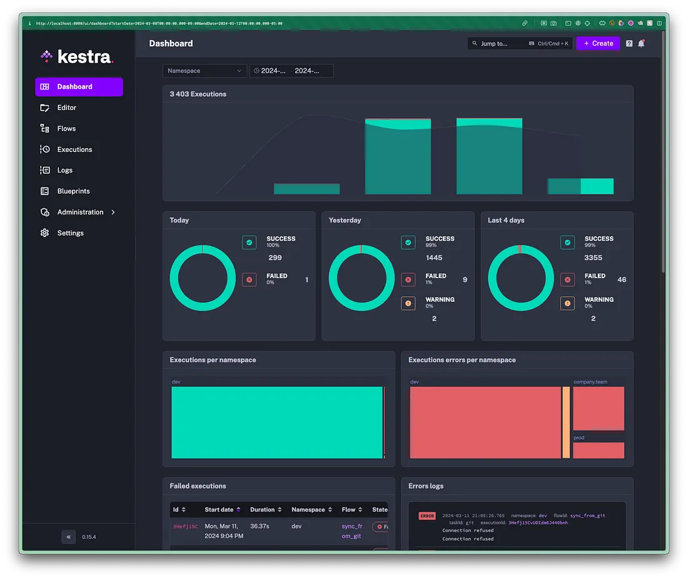

# Setting Up Automated Model Training Workflows with AWS S3
## Motivation
Consider you’re an e-commerce platform aiming to enhance recommendation personalization. Your data resides in S3.

To refine recommendations, you plan to retrain recommendation models using fresh customer interaction data whenever a new file is added to S3. But how exactly do you approach this task?

This repo shows how you can set up an automated model training workflows triggered by S3 using [Kestra](https://bit.ly/49OMyH9).

## Set up
1. Clone this repo:
```bash
git clone https://github.com/khuyentran1401/mlops-kestra-workflow.git
```
2. Go to the folder:
```bash
cd mlops-kestra-workflow
```
3. Create the ".env" file and pass your GitHub and AWS credentials:
```bash
GITHUB_USERNAME=mygithubusername
GITHUB_PASSWORD=mygithubtoken
AWS_ACCESS_KEY_ID=myawsaccesskey
AWS_SECRET_ACCESS_KEY=myawssecretaccesskey
# ! This line should be empty
```
Next, encode these secrets using the following bash script:
```bash
bash encode_env.sh
```
Executing this script generates a “.env_encoded” file containing encoded secrets:
```bash
# .env_encoded
SECRET_GITHUB_USERNAME=bXlnaXRodWJ1c2VybmFtZQ==
SECRET_GITHUB_PASSWORD=bXlnaXRodWJ0b2tlbg==
SECRET_AWS_ACCESS_KEY_ID=bXlhd3NhY2Nlc3NrZXk=
SECRET_AWS_SECRET_ACCESS_KEY=bXlhd3NzZWNyZXRhY2Nlc3NrZXk=
```
4. Start the Kestra server using Docker Compose
```bash
docker-compose up -d
```
Access the UI by opening the URL http://localhost:8080 in your browser.




## Run the flow
View [this article](https://medium.com/towards-data-science/setting-up-automated-model-training-workflows-with-aws-s3-cd0587b42f34) on how to execute the flow.
